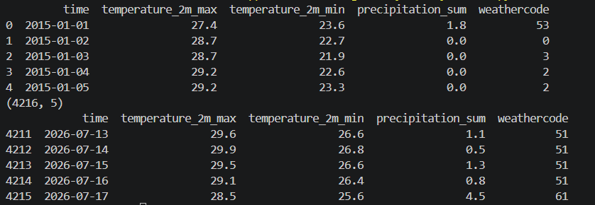

# Weather Prediction — Kochi

A Jupyter Notebook project that fetches 10 years of historical weather data for Kochi and experiments with regression models to predict daily temperature, precipitation, and weather condition.

## Overview

This project pulls a decade of daily weather observations for Kochi from the Open-Meteo historical API, engineers date- and lag-based features, and trains simple scikit-learn models to predict:

- Daily max/min temperature
- Precipitation sum
- Weather condition (WMO weather code)

It's an exploratory baseline, not a production forecasting system — the goal is to see how far basic regression models get before reaching for anything more sophisticated.

## Tech Stack
- Python (Jupyter Notebook)
- pandas, numpy, requests
- scikit-learn

## Data
- **Source:** Open-Meteo Historical Weather API (geocoding + archive endpoints)
- **Location:** Kochi, India
- **Range:** 2015-01-01 to 2026-08-07 (4,216 daily records)
- **Fields:** time, temperature_2m_max, temperature_2m_min, precipitation_sum, weathercode
- **Script:** weather_data_req.py looks up Kochi's coordinates, requests the daily archive, and saves it to kochi_10yr_weather.csv

## Pipeline & Features
- **Data Generation:** Custom script (`weather_data_req.py`) to request and compile a decade of historical weather metrics.
- **Baseline models:** Linear regression on month/day to predict max/min temperature; logistic regression on month/day to classify weather code.
- **Lag features:** Previous day's precipitation, weather code, and temperatures added as predictors, refitted for temperature, precipitation, and weather-code models.
- **Cyclical encoding:** month and day transformed into sine/cosine pairs to capture seasonality without a hard year-end discontinuity.
- **Time-aware evaluation:** A RandomForestRegressor trained on lag features (1-day lags + 7-day rolling means for temperature and precipitation) and evaluated with TimeSeriesSplit, so folds respect chronological order instead of shuffling past/future data together.
## Results & Baseline Metrics

Early linear/logistic baselines (random train-test split, month+day only):
- **Test R² Score:** 0.1375
- **Temperature Prediction:** ~70% accuracy
- **Weather Condition Prediction:** ~37% accuracy 
- **Precipitation Sum:** ~30% accuracy

**Note: These are first-pass baselines. month/day alone capture very little signal, which is why the notebook moves on to lag features, rolling averages, and chronological (TimeSeriesSplit) evaluation with a Random Forest — a more realistic test of forecasting performance. Metrics from that stage vary by fold and are printed at notebook runtime rather than fixed here.*

## Contents
- Feature engineering
- Model training & evaluation


## Data Preview

**Historical Weather Dataset Sample**


## Project Structure
```
weather_pred/
├── weather_pred.ipynb       # Modeling notebook (baseline + lag/rolling-feature models)
├── weather_data_req.py      # Fetches & saves the Kochi historical weather dataset
├── kochi_10yr_weather.csv   # Generated dataset (2015–2026)
├── requirements.txt
└── README.md
```
## How to Run
```bash
pip install -r requirements.txt
python weather_data_req.py      # generates kochi_10yr_weather.csv (optional if already present)
jupyter notebook weather_pred.ipynb
```
## Next Steps
- Fix the undefined n_splits in the TimeSeriesSplit cell before rerunning end-to-end.
- Formalize accuracy/error metrics for the precipitation and weather-code models on a proper hold-out set.
- Explore additional weather stations or external features (humidity, pressure, wind) for richer signal.

## Author
Pranav K — [Pranav10261](https://github.com/Pranav10261)
